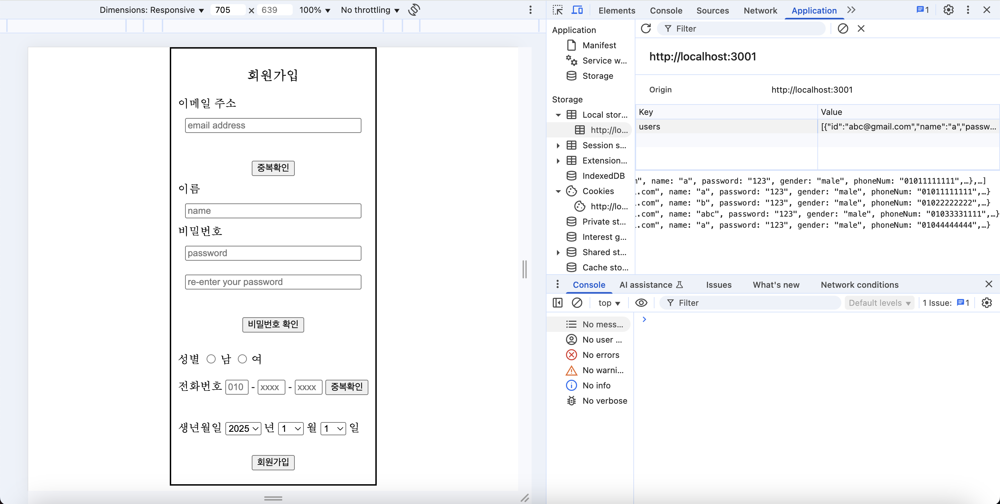
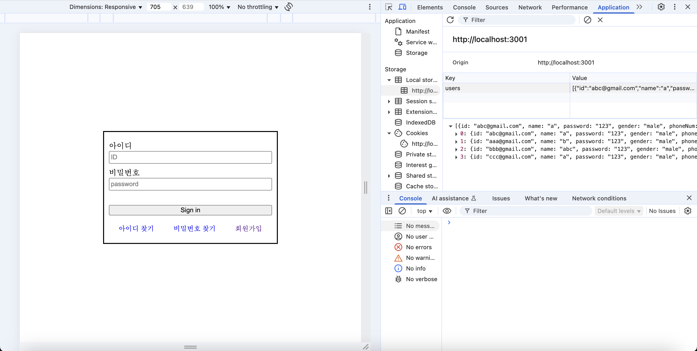
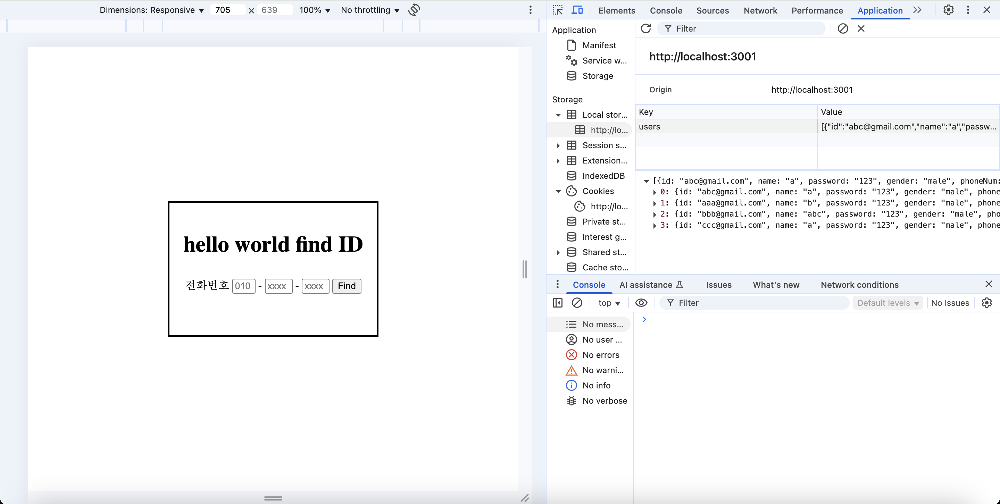
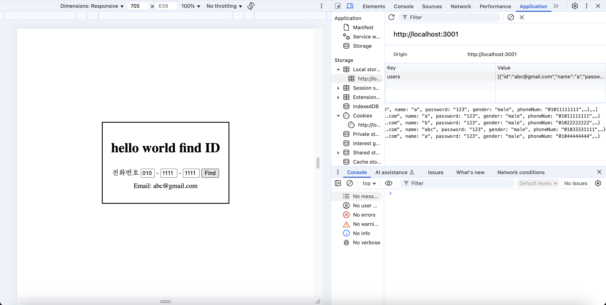
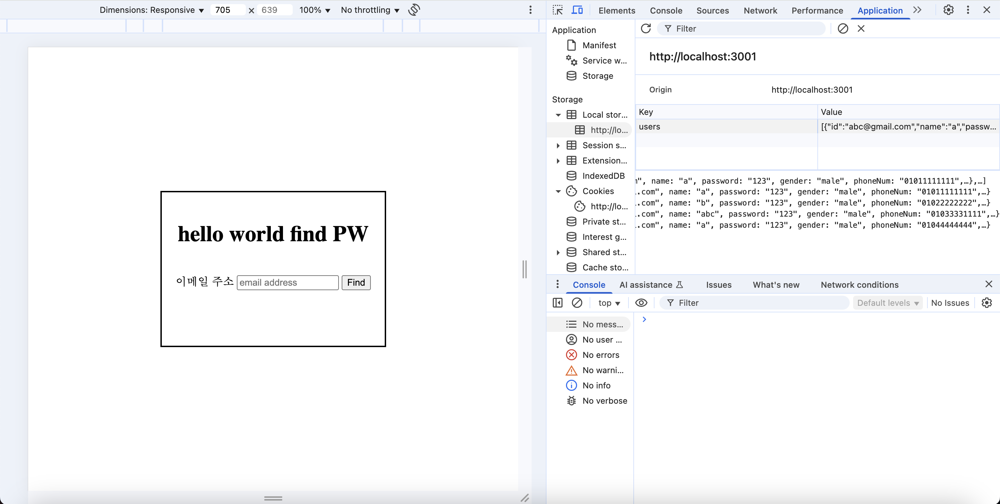
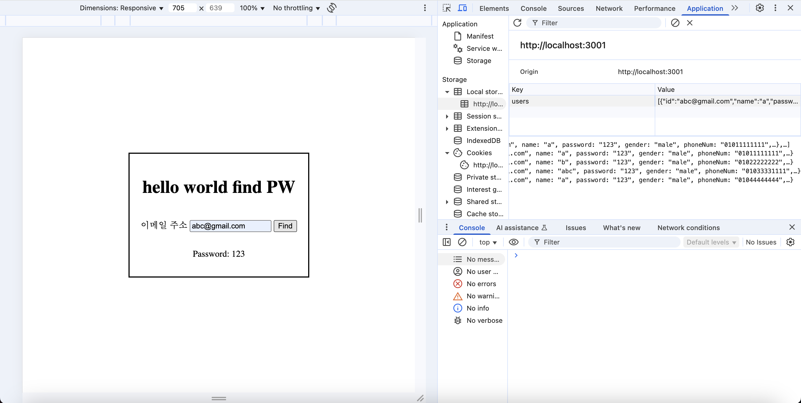
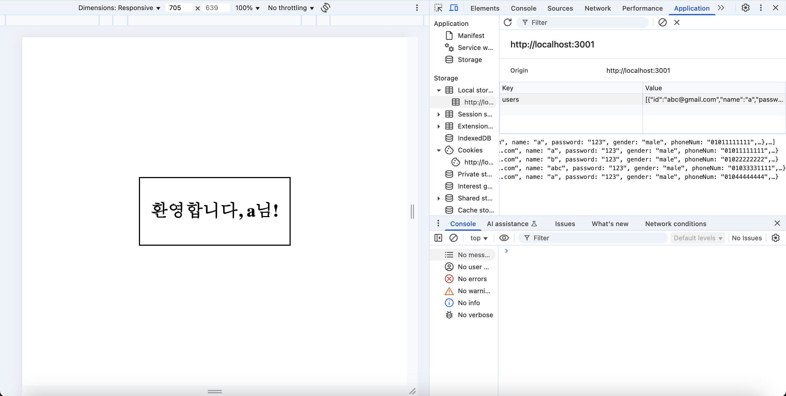

<div id="top">

<div align="center">

# <code>❯ Mini Project 1: Signup Page</code>

<em>A simple web application demonstrating user authentication flows with EJS, JavaScript, and CSS.</em>

<em>Built with the tools and technologies:</em>


</div>
<br>

---

## Table of Contents

- [Table of Contents](#table-of-contents)
- [Overview](#overview)
- [Features](#features)
- [Project Structure](#project-structure)
  - [Project Index](#project-index)
- [Getting Started](#getting-started)
  - [Prerequisites](#prerequisites)
  - [Installation](#installation)
  - [Usage](#usage)
- [Roadmap](#roadmap)
- [License](#license)
- [Acknowledgments](#acknowledgments)

---

## Overview 🌐

The **Mini Project1 Signup Page** is a straightforward web application designed to demonstrate fundamental user authentication flows. Built with **Node.js** and **Express.js** for the backend, it utilizes **EJS** (Embedded JavaScript) for server-side rendering of dynamic content, and plain **JavaScript** for client-side logic. Crucially, it uses **Web Storage (localStorage)** to save basic user information locally within the browser. The application provides basic functionalities for user registration, login, and account recovery, styled with simple **CSS**. It runs locally on `http://localhost:3001`.

---

## Features ✨

The **Mini Project 1: Signup Page** includes the following core functionalities:

- **User Registration:** A dedicated sign-up page allowing new users to create accounts.
- **User Login:** A main login interface for existing users to securely access the application.
- **Account Recovery (Find Username):** Functionality to assist users in retrieving their forgotten username.
- **Account Recovery (Find Password):** Functionality to assist users in resetting their forgotten password.
- **Server-Side Rendering with EJS:** Dynamic HTML pages generated on the server using EJS templates for efficient content delivery.
- **Client-Side Logic with JavaScript:** Interactive elements and form submissions are handled directly in the browser using plain JavaScript.
- **Simple Styling with CSS:** A clean and intuitive user interface designed with basic CSS for clear presentation.
- **Local Data Persistence:** Utilizes **localStorage** to save and retrieve user information directly within the browser.

---

## Screenshots 📸

Here are some visual representations of the **Mini Project1 Signup Page** in action, showcasing its key interfaces and functionalities.

### Signup Page

The primary interface for new user registration, collecting necessary information.



### Login Page

The entry point for registered users to access the application.



### Find Username

This section demonstrates the process of retrieving a forgotten username by providing the registered cell number.

#### Find Username - Input

Users enter their cell number to search for their associated username.



#### Find Username - Result

The result display showing the found username after successful lookup.



#### Find Password - Input

Users provide their email address to initiate the password recovery process.



#### Find Password - Result

The result display showing the found password after a successful lookup.



### Welcome Page & Local Storage View

Demonstrates a successful login to the welcome page and a view of user data stored in localStorage.



---

## Project Structure

```sh
└── /
    ├── node_modules
    │   ├── .bin
    │   ├── .package-lock.json
    │   ├── accepts
    │   ├── ansi-styles
    │   ├── anymatch
    │   ├── array-flatten
    │   ├── async
    │   ├── balanced-match
    │   ├── binary-extensions
    │   ├── body-parser
    │   ├── brace-expansion
    │   ├── braces
    │   ├── bytes
    │   ├── call-bind-apply-helpers
    │   ├── call-bound
    │   ├── chalk
    │   ├── chokidar
    │   ├── color-convert
    │   ├── color-name
    │   ├── concat-map
    │   ├── content-disposition
    │   ├── content-type
    │   ├── cookie
    │   ├── cookie-signature
    │   ├── debug
    │   ├── depd
    │   ├── destroy
    │   ├── dunder-proto
    │   ├── ee-first
    │   ├── ejs
    │   ├── encodeurl
    │   ├── es-define-property
    │   ├── es-errors
    │   ├── es-object-atoms
    │   ├── escape-html
    │   ├── etag
    │   ├── express
    │   ├── filelist
    │   ├── fill-range
    │   ├── finalhandler
    │   ├── forwarded
    │   ├── fresh
    │   ├── fsevents
    │   ├── function-bind
    │   ├── get-intrinsic
    │   ├── get-proto
    │   ├── glob-parent
    │   ├── gopd
    │   ├── has-flag
    │   ├── has-symbols
    │   ├── hasown
    │   ├── http-errors
    │   ├── iconv-lite
    │   ├── ignore-by-default
    │   ├── inherits
    │   ├── ipaddr.js
    │   ├── is-binary-path
    │   ├── is-extglob
    │   ├── is-glob
    │   ├── is-number
    │   ├── jake
    │   ├── lodash
    │   ├── math-intrinsics
    │   ├── media-typer
    │   ├── merge-descriptors
    │   ├── methods
    │   ├── mime
    │   ├── mime-db
    │   ├── mime-types
    │   ├── minimatch
    │   ├── ms
    │   ├── negotiator
    │   ├── nodemon
    │   ├── normalize-path
    │   ├── object-inspect
    │   ├── on-finished
    │   ├── parseurl
    │   ├── path-to-regexp
    │   ├── picomatch
    │   ├── proxy-addr
    │   ├── pstree.remy
    │   ├── qs
    │   ├── range-parser
    │   ├── raw-body
    │   ├── readdirp
    │   ├── safe-buffer
    │   ├── safer-buffer
    │   ├── semver
    │   ├── send
    │   ├── serve-static
    │   ├── setprototypeof
    │   ├── side-channel
    │   ├── side-channel-list
    │   ├── side-channel-map
    │   ├── side-channel-weakmap
    │   ├── simple-update-notifier
    │   ├── statuses
    │   ├── supports-color
    │   ├── to-regex-range
    │   ├── toidentifier
    │   ├── touch
    │   ├── type-is
    │   ├── undefsafe
    │   ├── unpipe
    │   ├── utils-merge
    │   └── vary
    ├── package-lock.json
    ├── package.json
    ├── public
    │   ├── css
    │   └── javascript
    ├── server.js
    └── views
        ├── findID.ejs
        ├── findPW.ejs
        ├── login.ejs
        ├── signup.ejs
        └── welcome.ejs
```

<details open>
    <summary><b><code>/</code></b></summary>
    <details>
        <summary><b>__root__</b></summary>
        <blockquote>
            <div class='directory-path' style='padding: 8px 0; color: #666;'>
                <code><b>⦿ __root__</b></code>
            <table style='width: 100%; border-collapse: collapse;'>
            <thead>
                <tr style='background-color: #f8f9fa;'>
                    <th style='width: 30%; text-align: left; padding: 8px;'>File Name</th>
                    <th style='text-align: left; padding: 8px;'>Summary</th>
                </tr>
            </thead>
                <tr style='border-bottom: 1px solid #eee;'>
                    <td style='padding: 8px;'><b><a href='/server.js'>server.js</a></b></td>
                    <td style='padding: 8px;'>- The server.js file implements the backend logic for a web application<br>- It uses Express.js to handle routing and serve EJS templates for login, signup, and password/ID retrieval<br>- The application receives user input for login and signup, logging login attempts<br>- It also directs users to various pages based on their requests, acting as the central controller for the applications user interface.</td>
                </tr>
                <tr style='border-bottom: 1px solid #eee;'>
                    <td style='padding: 8px;'><b><a href='/package-lock.json'>package-lock.json</a></b></td>
                    <td style='padding: 8px;'>This file is automatically generated by `npm` and records the **exact version and dependency tree** 🌳 of all installed packages. It ensures consistent builds across different environments by locking down the versions of direct and transitive dependencies for this Node.js project.</td>
                </tr>
                <tr style='border-bottom: 1px solid #eee;'>
                    <td style='padding: 8px;'><b><a href='/package.json'>package.json</a></b></td>
                    <td style='padding: 8px;'>This file defines the **project's metadata, scripts, and dependencies** 📦. It lists all required Node.js packages (e.g., Express, EJS, Nodemon) and defines runnable scripts (e.g., `start`, `test`) for the application.</td>
                </tr>
            </table>
        </blockquote>
    </details>
	<!-- public Submodule -->
	<details>
                <summary><b>css</b></summary>
                <blockquote>
                    <div class='directory-path' style='padding: 8px 0; color: #666;'>
                        <code><b>⦿ public/css</b></code>
                    <table style='width: 100%; border-collapse: collapse;'>
                    <thead>
                        <tr style='background-color: #f8f9fa;'>
                            <th style='width: 30%; text-align: left; padding: 8px;'>File Name</th>
                            <th style='text-align: left; padding: 8px;'>Summary</th>
                        </tr>
                    </thead>
                        <tr style='border-bottom: 1px solid #eee;'>
                            <td style='padding: 8px;'><b><a href='/public/css/findID.css'>findID.css</a></b></td>
                            <td style='padding: 8px;'>This CSS file contains the styling rules specifically for the **Find Username** page, ensuring its visual presentation aligns with the application's design.</td>
                        </tr>
                        <tr style='border-bottom: 1px solid #eee;'>
                            <td style='padding: 8px;'><b><a href='/public/css/login.css'>login.css</a></b></td>
                            <td style='padding: 8px;'>This CSS file defines the visual styles for the **Login Page**, controlling its layout, typography, and overall appearance to provide a consistent user experience.</td>
                        </tr>
                        <tr style='border-bottom: 1px solid #eee;'>
                            <td style='padding: 8px;'><b><a href='/public/css/findPW.css'>findPW.css</a></b></td>
                            <td style='padding: 8px;'>This CSS file provides the styling for the **Find Password** page, dictating its visual elements and ensuring it matches the application's aesthetic.</td>
                        </tr>
                        <tr style='border-bottom: 1px solid #eee;'>
                            <td style='padding: 8px;'><b><a href='/public/css/welcome.css'>welcome.css</a></b></td>
                            <td style='padding: 8px;'>This CSS file is responsible for the styling of the **Welcome Page**, providing the visual design for the post-login or successful interaction screen.</td>
                        </tr>
                        <tr style='border-bottom: 1px solid #eee;'>
                            <td style='padding: 8px;'><b><a href='/public/css/signup.css'>signup.css</a></b></td>
                            <td style='padding: 8px;'>This CSS file contains the styling definitions for the **Sign Up Page**, ensuring the registration form and related elements are visually cohesive.</td>
                        </tr>
                    </table>
                </blockquote>
            </details>
			<!-- javascript Submodule -->
			 <details>
                <summary><b>javascript</b></summary>
                <blockquote>
                    <div class='directory-path' style='padding: 8px 0; color: #666;'>
                        <code><b>⦿ public/javascript</b></code>
                    <table style='width: 100%; border-collapse: collapse;'>
                    <thead>
                        <tr style='background-color: #f8f9fa;'>
                            <th style='width: 30%; text-align: left; padding: 8px;'>File Name</th>
                            <th style='text-align: left; padding: 8px;'>Summary</th>
                        </tr>
                    </thead>
                        <tr style='border-bottom: 1px solid #eee;'>
                            <td style='padding: 8px;'><b><a href='/public/javascript/findPW.js'>findPW.js</a></b></td>
                            <td style='padding: 8px;'>This client-side JavaScript file handles the interactive logic for the **Find Password** page, managing user input and dynamically updating the interface during the password recovery process.</td>
                        </tr>
                        <tr style='border-bottom: 1px solid #eee;'>
                            <td style='padding: 8px;'><b><a href='/public/javascript/signup.js'>signup.js</a></b></td>
                            <td style='padding: 8px;'>This client-side JavaScript file manages the form submission and validation logic for the **User Sign Up** page, ensuring a smooth registration experience.</td>
                        </tr>
                        <tr style='border-bottom: 1px solid #eee;'>
                            <td style='padding: 8px;'><b><a href='/public/javascript/login.js'>login.js</a></b></td>
                            <td style='padding: 8px;'>This client-side JavaScript file implements the interactive elements and form handling for the **User Login** page, facilitating user authentication.</td>
                        </tr>
                        <tr style='border-bottom: 1px solid #eee;'>
                            <td style='padding: 8px;'><b><a href='/public/javascript/findID.js'>findID.js</a></b></td>
                            <td style='padding: 8px;'>This client-side JavaScript file provides the logic for the **Find Username** page, handling user interactions to assist with username retrieval.</td>
                        </tr>
                    </table>
                </blockquote>
            </details>
        </blockquote>
    </details>
	<!-- views Submodule -->
	Okay, let's update the summaries for the EJS template files in your views directory. These files are crucial for rendering the different pages of your application.

Here's how that section will look with the updated summaries:

Markdown

<details>
        <summary><b>views</b></summary>
        <blockquote>
            <div class='directory-path' style='padding: 8px 0; color: #666;'>
                <code><b>⦿ views</b></code>
            <table style='width: 100%; border-collapse: collapse;'>
            <thead>
                <tr style='background-color: #f8f9fa;'>
                    <th style='width: 30%; text-align: left; padding: 8px;'>File Name</th>
                    <th style='text-align: left; padding: 8px;'>Summary</th>
                </tr>
            </thead>
                <tr style='border-bottom: 1px solid #eee;'>
                    <td style='padding: 8px;'><b><a href='/views/login.ejs'>login.ejs</a></b></td>
                    <td style='padding: 8px;'>This EJS template renders the **Login Page**, providing the HTML structure and dynamic content for users to enter their credentials and access the application.</td>
                </tr>
                <tr style='border-bottom: 1px solid #eee;'>
                    <td style='padding: 8px;'><b><a href='/views/findID.ejs'>findID.ejs</a></b></td>
                    <td style='padding: 8px;'>This EJS template defines the structure and dynamic content for the **Find Username** page, allowing users to recover their forgotten usernames.</td>
                </tr>
                <tr style='border-bottom: 1px solid #eee;'>
                    <td style='padding: 8px;'><b><a href='/views/findPW.ejs'>findPW.ejs</a></b></td>
                    <td style='padding: 8px;'>This EJS template is used to render the **Find Password** page, providing the interface for users to reset or recover their forgotten passwords.</td>
                </tr>
                <tr style='border-bottom: 1px solid #eee;'>
                    <td style='padding: 8px;'><b><a href='/views/signup.ejs'>signup.ejs</a></b></td>
                    <td style='padding: 8px;'>This EJS template creates the **Sign Up Page**, providing the form and structure for new users to register an account within the application.</td>
                </tr>
                <tr style='border-bottom: 1px solid #eee;'>
                    <td style='padding: 8px;'><b><a href='/views/welcome.ejs'>welcome.ejs</a></b></td>
                    <td style='padding: 8px;'>This EJS template renders the **Welcome Page**, which is displayed to users upon successful login or after completing a specific action, offering a personalized greeting.</td>
                </tr>
            </table>
        </blockquote>
    </details>
</details>

---

## Getting Started

To get a local copy up and running, follow these simple steps.

### Prerequisites

This project requires the following dependencies to be installed on your system:

- **Node.js**: It's recommended to use a recent LTS (Long Term Support) version. You can download it from [nodejs.org](https://nodejs.org/).
- **npm** (Node Package Manager): This usually comes bundled with Node.js.

### Installation

Build the project from the source and install its dependencies:

1.  **Clone the repository:**

    ```sh
    git clone [https://github.com/hellojuhyoung/miniProject1_signup_page.git](https://github.com/hellojuhyoung/miniProject1_signup_page.git)
    ```

2.  **Navigate to the project directory:**

    ```sh
    cd miniProject1_signup_page
    ```

3.  **Install the dependencies:**
    This command will install all necessary packages listed in `package.json`.
    ```sh
    npm install
    ```

### Usage

To run the project locally after installation:

**Using [npm](https://www.npmjs.com/):**

```sh
npm start
```

## Roadmap 🛣️

This project provides a foundational user authentication system. Future enhancements could include:

- [ ] **Backend Integration for Persistence**: Implement a database (e.g., MongoDB, PostgreSQL, or a simpler file-based JSON store if preferred) to securely store user credentials and profiles, moving beyond in-memory data if currently used.
- [ ] **Secure Password Hashing**: Integrate a robust hashing algorithm (e.g., bcrypt) to securely store user passwords, significantly enhancing security.
- [ ] **Session Management**: Implement server-side sessions or JWT (JSON Web Tokens) to maintain user login state across requests, providing a persistent and secure user experience.
- [ ] **Comprehensive Input Validation & Error Handling**: Enhance both client-side and server-side validation for all input fields (signup, login, recovery) and provide clear, actionable error messages to the user.
- [ ] **User Profile Management**: Allow logged-in users to view and update their basic profile information.
- [ ] **Email-Based Account Recovery**: Implement a feature to send password reset links or username reminders via email for more secure account recovery.
- [ ] **Enhanced UI/UX**: Improve the overall visual design and user experience of all pages, possibly by incorporating a CSS framework (like Bootstrap or Tailwind CSS) or more custom styling.
- [ ] **Social Media Login Integration**: Add options for users to sign up or log in using popular social media accounts (e.g., Google, Kakao, etc.).

---

## License

**Mini Project1 Signup Page** is protected under the [LICENSE](https://choosealicense.com/licenses) License. For more details, refer to the [LICENSE](https://choosealicense.com/licenses/) file.

---

## Acknowledgments 🙏

This project was developed as a practice and study exercise to gain familiarity with:

- **EJS (Embedded JavaScript)**: Understanding its use as a templating engine for rendering dynamic web content.
- **Nodemon**: Learning how to use Nodemon for automatic server restarts during development, streamlining the development workflow.
- **Login System Logic**: Practicing the fundamental logic involved in user authentication.
- **Handling Signup Information**: Gaining experience in processing and managing user registration data.

A special thanks to the learning resources and concepts that guided this development process.

<div align="right">

[![][back-to-top]](#top)

</div>

[back-to-top]: https://img.shields.io/badge/-BACK_TO_TOP-151515?style=flat-square

---
